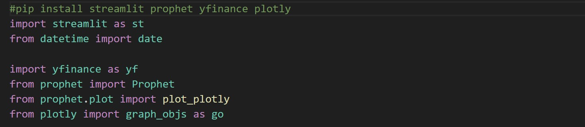
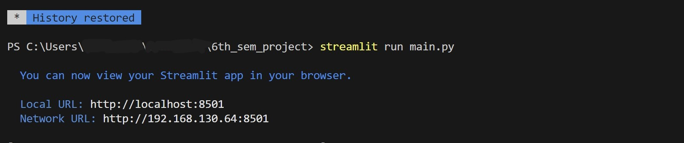
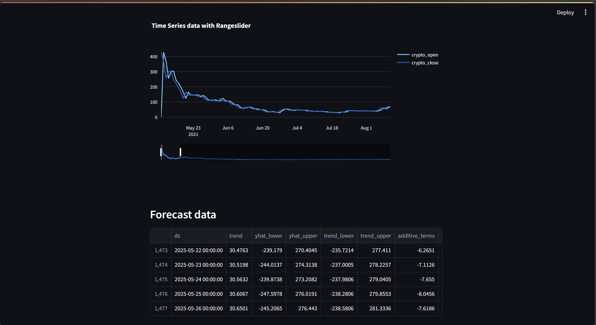
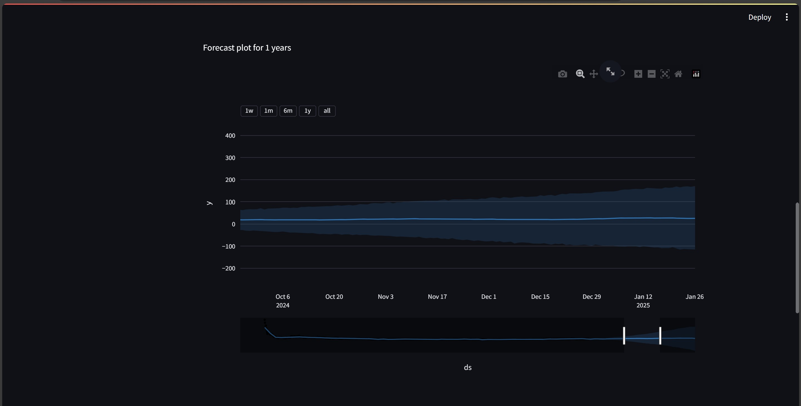
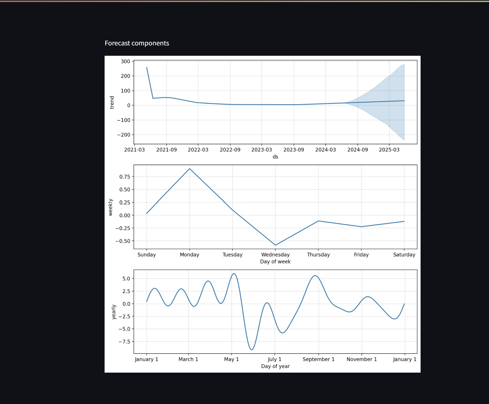

##CRYPTO_PRICE_PREDICTION

<h3 align="center">Requirements</h3>
<h4 align="center">Python Environment</h4>

<h3 align="center">Dependencies</h3>
<h4 align="center">Libraries : Sreamlit , prophet (formerly fbprophet) ,plotly </h4>

<h3 align="center">Main Code</h3>
<h4 align="center">Ref. to main.py </h4>

<h3 align="center">Run using Streamlit</h3>

<h3 align="center">Application Overview</h3>
  
  
  
  

